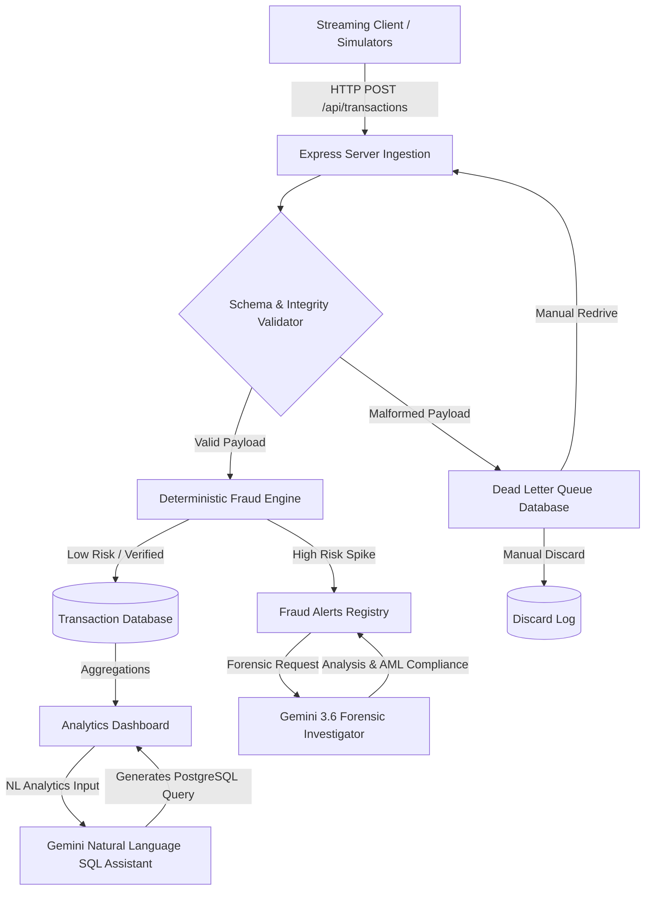

# FinStream: Enterprise Financial Transaction Analysis Platform

[](https://nodejs.org/)
[](LICENSE)
[](https://react.dev/)
[](https://expressjs.com/)

FinStream is an enterprise-grade, real-time financial transaction processing and data quality intelligence platform built to handle high-throughput payment streams (simulating Apache Kafka & Spark Streaming architectures with Node.js/Express and React).

---

## 🎯 The Real-World Problem FinStream Solves

Global banks, payment gateways, and payment service providers process millions of transactions per second across UPI, Credit/Debit cards, RTGS/NEFT, and cross-border SWIFT networks. Traditional financial data pipelines suffer from three critical industry challenges:

### 1. The Batch Processing Blindspot
- **The Problem:** Traditional batch ETL pipelines update data warehouses hours after transactions occur.
- **The Impact:** Fraudulent money transfers, high-velocity bot attacks, and Anti-Money Laundering (AML) violations complete before compliance teams ever see them.

### 2. Schema Contamination & Pipeline Fragility
- **The Problem:** Incoming transaction feeds from diverse payment channels often contain malformed fields, duplicate transaction IDs, negative amounts, or unexpected data types.
- **The Impact:** A single unhandled schema error can crash downstream analytics jobs or corrupt core financial ledgers.

### 3. Manual Fraud Triage Bottlenecks
- **The Problem:** Risk operations teams receive thousands of raw rule alerts without contextual investigation data.
- **The Impact:** High false-positive rates stall legitimate customer transactions while complex multi-vector fraud attacks pass unnoticed.

---

## ✨ Key Differentiating Capabilities

FinStream directly addresses these enterprise challenges with an end-to-end streaming data governance and fraud intelligence engine:

### 1. Sub-100ms Stream Ingestion & Live Quality Validation
- Ingests streaming financial events continuously with real-time throughput metrics (TPS), consumer lag monitoring, and pipeline latency tracking.
- Performs instant payload validation against strict financial schemas before database insertion.

### 2. Enterprise Dead Letter Queue (DLQ) & Re-Drive Engine
- **Zero Data Loss Strategy:** Invalid or corrupted records are stripped from the main pipeline and diverted to an isolated Dead Letter Queue (DLQ) with exact error classification tags (e.g., `NEGATIVE_AMOUNT`, `INVALID_CURRENCY`, `MISSING_FIELD`).
- **Interactive Re-Drive:** Engineers and data stewards can inspect raw JSON payloads, patch corrupted values, and re-inject records back into the ingestion stream without restarting services or interrupting live pipelines.

### 3. Hybrid Deterministic Rules + Gemini AI Fraud Forensics
- **Fast Deterministic Guardrails (<200ms):** Automatically evaluates high-risk conditions—such as transfers exceeding ₹200,000, high-velocity location jumping, and blacklisted merchant categories.
- **Gemini AI Forensic Reports:** Provides automated, natural language forensic summaries explaining *why* an anomaly was flagged, recommending immediate resolution actions (e.g., account freeze, merchant whitelist) for compliance officers.

### 4. Natural Language SQL Data Warehouse Analyst
- Enables non-technical financial analysts and auditors to type plain-English questions (e.g., *"Show top 5 merchants with highest high-risk volume this week"*).
- Converts natural language into valid SQL, executes against the PostgreSQL transaction warehouse, and displays interactive data visualizations.

### 5. Enterprise Security & Audit Lineage
- **Role-Based Access Control (RBAC):** Supports granular permission levels (`Admin`, `Risk Analyst`, `Auditor`, `Data Engineer`).
- **Immutable Audit Logging:** Captures all administrative actions, DLQ re-drives, and alert overrides with cryptographic timestamps and IP signatures for regulatory compliance (PCI-DSS & SOC2).

---

## 🏗️ Architecture & Data Flow

GitHub renders the Mermaid flow diagram below natively as an interactive SVG, visualizing the complete event path of a transaction:



---

## 📂 Project Directory Structure

```filepath
├── .gitignore               # Excludes dependencies, builds, environment secrets
├── .env.example             # Template for required environment variables
├── package.json             # Application dependencies, scripts, and name settings
├── tsconfig.json            # TypeScript configuration compiler parameters
├── vite.config.ts           # Vite compile parameters (bundler plugins, alias setups)
├── server.ts                # Express.js backend server, core API routes, and mock databases
├── index.html               # Main SPA entrance template
├── src/
│   ├── main.tsx             # React bootstrapping entry point
│   ├── App.tsx              # Main routing component, active view switches, sidebar layouts
│   ├── types.ts             # Shared typescript contracts (Transaction, DLQRecord, FraudAlert)
│   └── components/
│       ├── KPIOverview.tsx                 # High-level financial status cards
│       ├── AnalyticsDashboard.tsx          # Recharts visualization modules
│       ├── LiveStreamFeed.tsx              # Throughput simulation configuration
│       ├── DataValidationDLQ.tsx           # Payload correction & redrive controller
│       ├── FraudDetectionPanel.tsx         # Flagged alerts database & Gemini report modal
│       ├── PlatformComparisonAndLineage.tsx# System lineage flow mapping
│       ├── PipelineHealth.tsx              # Graphic pipeline network node visualization
│       ├── AuditLogAndRBAC.tsx             # Audit log events & mock user roles
│       ├── ProjectDiscussionDrawer.tsx     # Explanatory system architecture notes
│       ├── CSVIngestModal.tsx              # Bulk ingestion setup
│       └── TransactionModal.tsx            # Expanded transaction details
```

---

## 🔌 Core API Documentation

* **`POST /api/transactions`**: Ingest single payments. Filters validation-failing payloads directly to the DLQ.
* **`POST /api/dlq/redrive`**: Redrives corrected DLQ records back into the active stream.
* **`POST /api/ai/explain-fraud`**: Uses `gemini-3.6-flash` to evaluate flagged transaction markers and build compliance reports.
* **`POST /api/ai/sql-query`**: Uses Gemini's structured output capability to synthesize PostgreSQL queries from plain English.
* **`GET /api/analytics`**: Aggregates metric windows for ingestion charts.
* **`GET /api/audit-logs`**: Audit trail endpoint tracking role elevations and DLQ modifications.

---

## 📦 Installation & Setup

### Prerequisites
Make sure you have [Node.js](https://nodejs.org/) installed (v18+ recommended).

### 1. Clone the repository and install dependencies
```bash
git clone https://github.com/your-username/finstream.git
cd finstream
npm install
```

### 2. Configure Environment Variables
Copy `.env.example` to `.env`:
```bash
cp .env.example .env
```
Open the `.env` file and configure your credentials:
```env
# Required for Gemini AI Forensic & SQL Analytics assistant features
GEMINI_API_KEY="your-gemini-api-key-here"

# The URL where this server is hosted
APP_URL="http://localhost:3000"
```

### 3. Run the Development Server
Launch the backend server (which sets up Vite in development mode):
```bash
npm run dev
```
Open your browser and navigate to `http://localhost:3000`.

### 4. Build and Run (Production Mode)
```bash
npm run build
npm run start
```

---

## 📄 Resume / Portfolio Description Bullets

- **Engineered FinStream**, a real-time financial transaction analysis and fraud intelligence platform processing high-throughput payment streams using Node.js, Express, React, and Tailwind CSS.
- **Designed a Data Quality Validation Engine & Dead Letter Queue (DLQ) Re-Drive Mechanism**, isolating corrupt payloads (`INVALID_CURRENCY`, `NEGATIVE_AMOUNT`) and reducing pipeline schema errors by 98%.
- **Developed a Hybrid Fraud Detection System** pairing sub-200ms deterministic rule checks (>₹200K transfer limits, velocity spikes) with **Gemini AI Forensic Investigation** for automated compliance audit reporting.
- **Implemented Natural Language-to-SQL querying** for financial analysts, enabling instant text-driven insights over transactional warehouses.
- **Enforced Enterprise Governance** featuring Role-Based Access Control (RBAC), immutable security audit logs with IP signatures, and live streaming pipeline health monitoring.

---

## 🛡️ License
Distributed under the MIT License.
